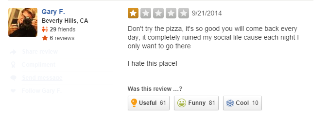
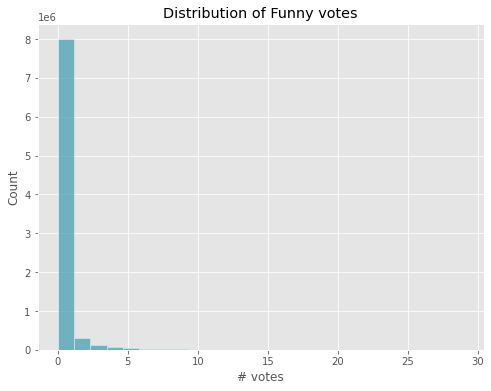
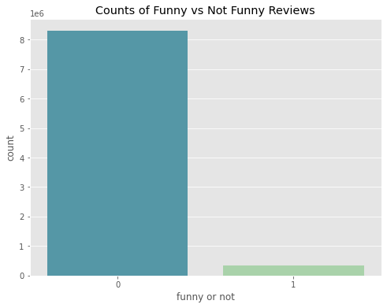
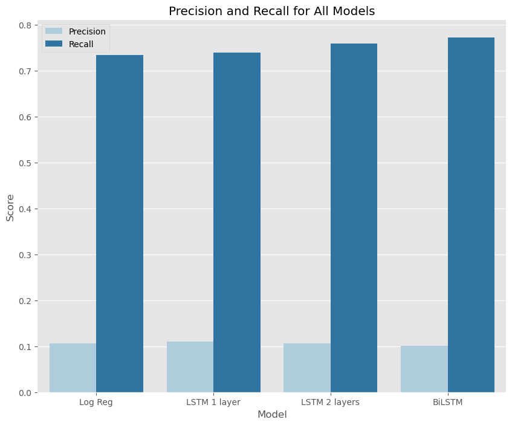
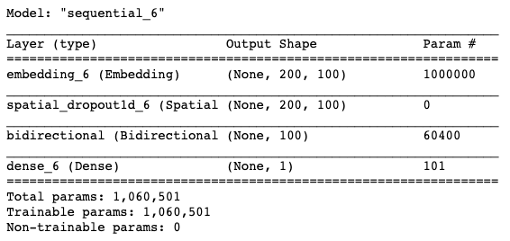
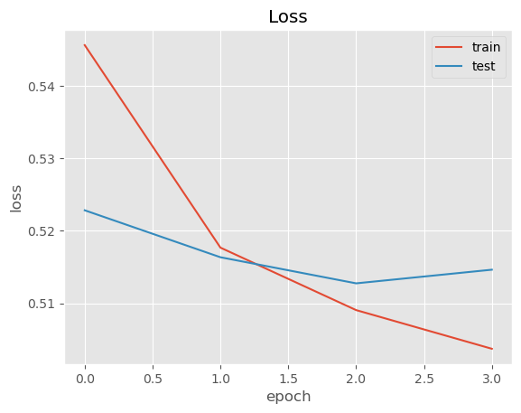
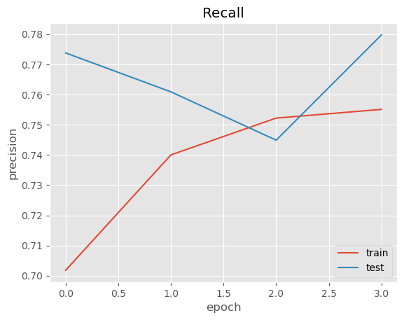
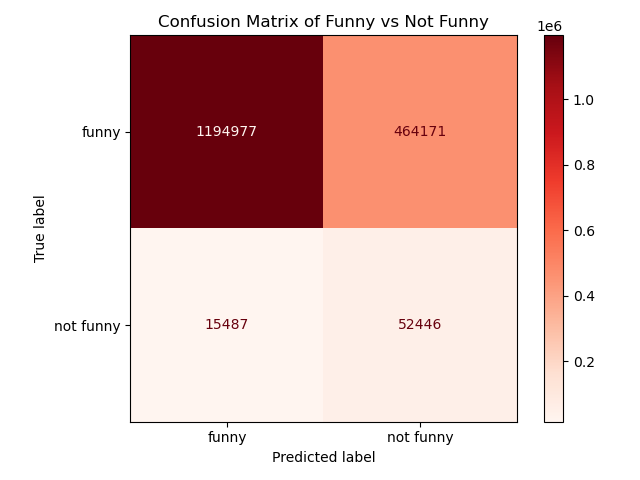

# Detecting Humor with LSTMs

## Motivation

Humor detection in texts has many interesting applications. When building artificial intelligence systems such as chatbots and virtual assistants, identifying humor in users' input text can enhance the overall user experience by enabling the system to understand the real motives behind a user's queries. An advanced outcome from this would be to inject humor into computer-generated responses, making human-computer interactions feel more engaging and entertaining.

In the context of review data, funny reviews often draw more attention to the business or product. Identifying these humorous reviews could allow them to be pushed to the top of a page to increase user engagement.

For this project I sought to build my own humor detector. I worked with the Yelp Open Dataset, which contains about 8.6 million reviews, each with a 'funny' attribute corresponding to the number of votes a review has received.

## Defining Humor ##

A look at the histogram for the distribution of the 'funny' column revealed a heavy right skew, with the majority of reviews having 0 votes. The number of votes ranged up to 610.

After examining individual reviews, 3 votes seemed to be a good cut-off for defining whether a review is humorous to account for noise in 1 and 2 vote reviews. Using this definition, 340,864 out of 8,635,403 total reviews, or about 4%, are considered funny. I chose to turn this into a binary classification problem of funny vs not funny, and used undersampling to create a balanced training dataset.

## Data and Text Processing ##

The data was downloaded from the Yelp website. A preview of the data after removing irrelevant columns can be found in 'data'. Before modeling, I preprocessed the text to get it into the correct format.

I started with logistic regression to get a baseline classification. My text processing pipeline involved:

- Text cleaning
- Tokenization
- Vectorization

I opted to keep stopwords, punctuation, and casing, as these are likely to contribute to humor. I then vectorized the data into a TF-IDF matrix of 3000 features, including bi-grams. TF-IDF is a word count vectorization that takes into account the frequency with which a term appears in a review, as well as how many times it appears in other reviews, to assign a feature a numerical statistic that reflects its relevance to a given review.

I then chose to use LSTMs (Long Short-Term Memory) to model humor with deep learning. LSTMs is a type of recurrent neural network that takes into account the sequential nature of text data. Unlike regular RNN's, they also avoid the problem of vanishing gradients by only storing information that is important.

For the LSTMs, the process involved:

- Text cleaning
- Tokenization
- Sequence creation

I chose maximum features of 10000 (most frequent words), with max sequence length of 200. If a review contains more or less than the max sequence length, it will either be truncated or padded so the input sequences all have the same length for modeling.

## Modeling and Evaluation ##

The four models I compared are:

- Logistic Regression on TF-IDF
- LSTM with one layer
- LSTM with two layers
- Bidirectional LSTM

A bidirectional LSTM is essentially two LSTMS looking in opposite directions. The network starts with an Embedding layer, which allows the system to expand each token into a larger vector to represent the word in a meaningful way. The bidirectional layer connects the two LSTMs to the same output. It increases the amount of information available to the network, improving the context available (e.g. the words that follow and precede a word in a sentence).

I chose to optimize for recall to minimize false negatives. If a business wants to use funny reviews to increase revenue, they want to be sure that the review they're showing is in fact funny, given that it was detected as funny.

The Precision and Recall for all models were:

- Logistic Regression: Precision = 0.1065, Recall = 0.7343
- LSTM with one layer: Precision = 0.1104, Recall = 0.7397
- LSTM with two layers: Precision = 0.1056, Recall = 0.7586
- Bidirectional LSTM: Precision = 0.1015, Recall = 0.7720

Although the precision numbers may seem low, they are all ~2.5x the baseline of pure chance (4%) on an extremely unbalanced dataset. 

The model with the highest recall was the Bidirectional LSTM, which was trained over 4 epochs and produced a loss (binary crossentropy) of 0.5525.

Further evaluating the model produced the following confusion matrix:

## Conclusions ##

The model that performed the best was the Bidirectional LSTM, which can be explained by the fact that humor is heavily context-dependent. For a given word, signals of humor can be given by surrounding words in both directions, not just forward. 

With 10% precision and 77% recall, the model is correctly labeling about 10% of the reviews the model is detecting as funny. Of those 10%, 77% of reviews are being returned. A high recall ensures we are not missing any funny reviews, which is important when using humor to increase engagement.
